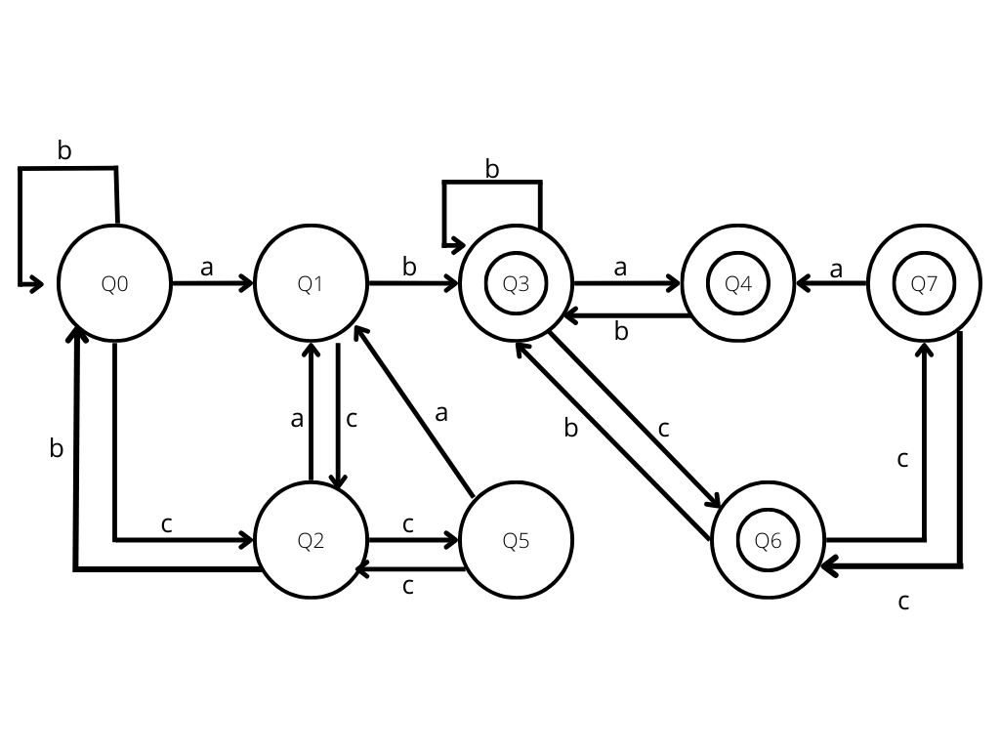
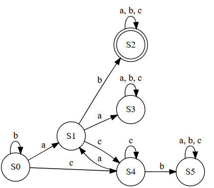
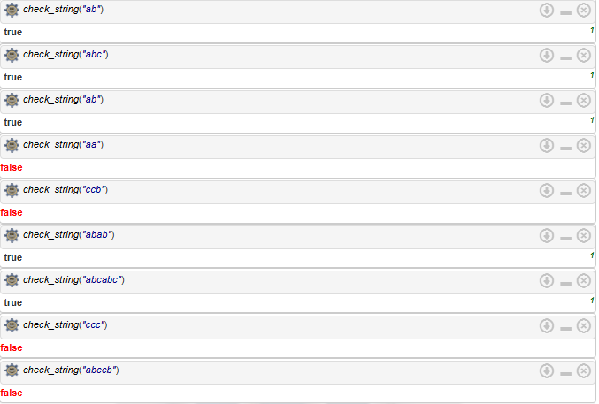

# E1 Implementation of Lexical Analysis (Automaton and Regular Expression)

- Mateo Minghi Vega

- A01711231

---

### Theoretical Framework

Stanford describes automata as abstract models of machines that perform computations on an input by moving through a series of states or configurations. [1]

A "state" is a particular situation or configuration of the automaton at a given point. The automaton follows a specific rule for each step. If it reaches a final "accepting" state, the input is considered valid.

There are several types of automata, but for the purposes of this project, I'm going to focus on finite automata.

Finite-state automata are computation models for a small amount of memory, and do not maintain memory.They can only reach a finite number of states and transitions between these states. [1]

A finite-state machine (or automaton) is formally defined as a 5-tuple (Q, I, Z, ∂, W) where:

- Q = finite set of states
- I = finite set of input symbols
- Z = finite set of output symbols
- ∂ = state transition function, (I x Q → Q)
- W = mapping W of I x Q onto Z, called the output function
- A = set of accept states where F is a subset of Q

A deterministic finite automaton (DFA) is a machine composed of a finite set of states linked by arcs labeled with symbols from a finite alphabet. Each time a symbol is read, the machine changes state, the new state is uniquely determined by the
symbol read and the labeled arcs from the current state. [2]

Regular expressions are patterns used to match character combinations in strings.

---

### Description

In this case, I have to design an automaton and a regex for correctly detecting this language:

- all possible combinations of "abc"
- must not have "ccb" or "aa"
- must contain "ab"

### Design

Given the nature of thes selected language, which only has three letters, a DFA is a good choice for the automaton. Although DFAs are generally harder to design than NFAs, having such a limited language doesn't make the DFA that much harder to design. Asside from that, DFAs are easier to implement.

For correctly detecting my language, I came up with a very strict regex:

```regex
^(?!.*aa)(?!.*ccb)[abc]*ab[abc]*$
```

> with (?!.\*aa) I ensure there is no "aa"

> with (?!.\*ccb) I ensure there is no "ccb"

> with \*ab I ensure there is always "ab"

---

### DFA 1.0 (Terrible mistake)

The DFA I designed allows data to flow across states in a "bi-directional" way. For example, you can go from State1 to State2, but also from State2 to State1. That came from a very fundamental missunderstanding of DFAs.

In a DFA, each state has exactly one transition per input symbol leading to a single next state. Allowing bidirectional transitions would mean that for a single input symbol, the automaton could go to multiple states, violating determinism.

It's also worth pointing out that a DFA does not have memory. A DFA processes an input string from left to right without the ability to move backward. It does not have memory or a stack like a pushdown automaton or a Turing machine. This means that my initial design was fundamentaly wrong, and to make matters worse, I spent like 2 hours drawing it on Canva:



| State | a   | b   | c   | Final? |
| ----- | --- | --- | --- | ------ |
| s0    | s1  | s0  | s2  | No     |
| s1    | –   | s3  | s2  | No     |
| s2    | s1  | s0  | s5  | No     |
| s3    | s4  | s3  | s6  | Yes    |
| s4    | –   | s3  | s6  | Yes    |
| s5    | s1  | –   | s2  | No     |
| s6    | s4  | s3  | s7  | Yes    |
| s7    | s4  | –   | s6  | Yes    |

---

### DFA 2.0 (Correct version)

After realizing my mistake from the initial design, I came up with another DFA that would correctly map out the desired language. I deceided to stick to a DFA rather than an NFA because it was extremely easy to implement in prolog. The corrected design looks like this:



With this design, we define S2 as the final state, with these transitions:

- "a" moves from S0 → S1.

- "b" moves from S1 → S2 (valid "ab" substring).

- "a" moves from S1 → S3 (invalid "aa", dead state).

- "c" moves from S0 → S4 and "c" from S4 → itself.

- "b" from S4 → S5 (dead state for "ccb").

- Dead states (S3 and S5) loop to themselves.

### Implementation

```prolog
% DFA
% Language: All combinations of "abc"
% Must contain "ab"
% Must not contain "aa" or "ccb"

% Transitions
transition(s0, b, s0).
transition(s0, a, s1).
transition(s0, c, s4).

transition(s1, a, s1).
transition(s1, b, s2).
transition(s1, c, s4).

transition(s2, a, s2).
transition(s2, b, s2).
transition(s2, c, s2).

transition(s3, a, s3).
transition(s3, b, s3).
transition(s3, c, s3).

transition(s4, c, s4).
transition(s4, a, s1).
transition(s4, b, s5).

transition(s5, a, s5).
transition(s5, b, s5).
transition(s5, c, s5).

% Final states
final_state(s2).

% Check if a string is accepted by the DFA
check_string(String) :-
    atom_chars(String, Chars),
    process_string(Chars, s0).

% Process the string
process_string([], CurrentState) :-
    final_state(CurrentState).
process_string([Char|Rest], CurrentState) :-
    transition(CurrentState, Char, NextState),
    process_string(Rest, NextState).
```

And using some test cases, we can see it works properly! Further automated testing can be found in test_cases.pl



I asked chatgpt to translate this code into c++, just to showcase the beauty of a language like Prolog, and how it is extremely useful for problems like this one:

```cpp
#include <iostream>
#include <string>
#include <map>
#include <set>
#include <vector>

class DFA {
private:
    // Define transitions using nested map: current_state -> input -> next_state
    std::map<std::string, std::map<char, std::string>> transitions;
    std::set<std::string> finalStates;

    void initializeTransitions() {
        // s0 transitions
        transitions["s0"]['a'] = "s1";
        transitions["s0"]['b'] = "s0";
        transitions["s0"]['c'] = "s2";

        // s1 transitions
        transitions["s1"]['b'] = "s3";
        transitions["s1"]['c'] = "s2";

        // s2 transitions
        transitions["s2"]['a'] = "s1";
        transitions["s2"]['b'] = "s0";
        transitions["s2"]['c'] = "s5";

        // s3 transitions
        transitions["s3"]['a'] = "s4";
        transitions["s3"]['b'] = "s3";
        transitions["s3"]['c'] = "s6";

        // s4 transitions
        transitions["s4"]['b'] = "s3";
        transitions["s4"]['c'] = "s6";

        // s5 transitions
        transitions["s5"]['a'] = "s1";
        transitions["s5"]['c'] = "s2";

        // s6 transitions
        transitions["s6"]['a'] = "s4";
        transitions["s6"]['b'] = "s3";
        transitions["s6"]['c'] = "s7";

        // s7 transitions
        transitions["s7"]['a'] = "s4";
        transitions["s7"]['c'] = "s6";

        // Initialize final states
        finalStates.insert("s3");
        finalStates.insert("s4");
        finalStates.insert("s6");
        finalStates.insert("s7");
    }

public:
    DFA() {
        initializeTransitions();
    }

    bool checkString(const std::string& input) {
        std::string currentState = "s0";

        for (char c : input) {
            // Check if transition exists
            if (transitions[currentState].find(c) == transitions[currentState].end()) {
                return false;
            }
            currentState = transitions[currentState][c];
        }

        // Check if final state is reached
        return finalStates.find(currentState) != finalStates.end();
    }
};

int main() {
    DFA dfa;
    std::string input;

    std::cout << "Enter a string to check (using only a, b, c): ";
    std::cin >> input;

    if (dfa.checkString(input)) {
        std::cout << "String accepted\n";
    } else {
        std::cout << "String rejected\n";
    }

    return 0;
}
```

---

### Algorithmic Complexity

Most of my implementation of the DFA in Prolog uses transition facts. A transition in Prolog requires a search through the available facts, which typically takes O(1) time. [3]

My function check_string converts the input string into a list of characters, which has O(n) complexity. The function process_string also has O(n) complexity.

For space complexity, since im using recursion for state transitions, the depth of recursive calls is at most O(n) in the worst case.

---

### References

[1] Basics of Automata Theory. (s. f.). https://cs.stanford.edu/people/eroberts/courses/soco/projects/2004-05/automata-theory/basics.html

[2] Eibe Frank, "Formal Languages and Automata". https://www.its.caltech.edu/~matilde/FormalLanguageTheory.pdf

[3] Complexity in Prolog programs? (2010). Stack Overflow. https://stackoverflow.com/questions/1777272/complexity-in-prolog-programs

[4] Benjamín Valdez (2025). TC2037 - Implementation of Computational Methods.

---

### Competences

"STC0101
Implementación de algoritmos computacionales" The implementation of the algorithms works correctly. The program includes automated tests that show the algorithm works properly
both: best practices and correct style are followed in the implementation

"STC0102
Optimización de algoritmos computacionales" Time and space complexity are correctly analyzed
At least two correct solutions were presented. (regex vs automata)
A benchmark of the solutions is presented and analyzed.

"STC0103
Generación de modelos computacionales" The model is clearly explained through a diagram. (the automata and regex)
A complete explanation of the rational of the model is presented beside the diagram
The explanation contains the theoretical/mathematical backing for the ideas presented in the model, formal references must be included and properly cited IEEE or APA.

"STC0104
Implementación de modelos computacionales" The implementation of the model is consistent with the documentation generated.
The Implemented model also contains a set of documented tests to show that the model works as intended and correctly solves the problem
The program passes successfully all the tests
